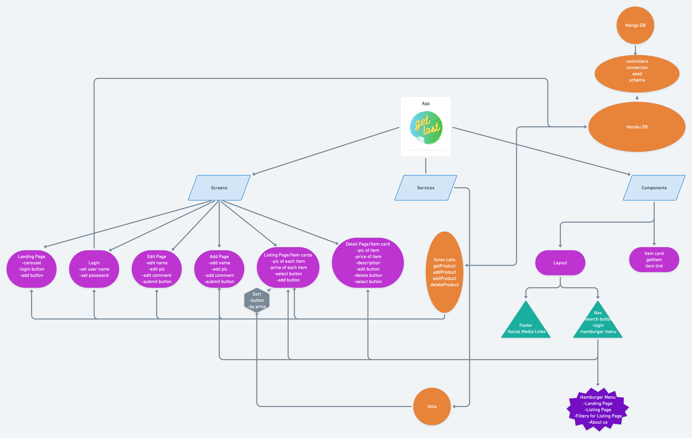

# get-lost


## Overview

Get Lost is a retail webstore featuring travel products. Specifically, Get Lost features backpacks, carry-all's, fanny-packs, and other travel accessories for carrying all the stuff you need on-the-go.

## Color Scheme


## Wireframes and Prototype

[Wireframes](https://www.canva.com/design/DAESRseRiGI/NbONkDtclRCAfoCm7KShPA/view?utm_content=DAESRseRiGI&utm_campaign=designshare&utm_medium=link&utm_source=sharebutton)

[Color Palette] (https://www.canva.com/design/DAESTQN4Zds/luEJC434VXLyJyN-dQKb7A/view?utm_content=DAESTQN4Zds&utm_campaign=designshare&utm_medium=link&utm_source=sharebutton
)

## Component Hierarchy



## API Data

[Get Lost API](https://get-lost-api.herokuapp.com/api/products)

### Data Sample:

```
{
_id: "5ff4902e7cca390004309d1a",
name: "Osprey Daylite Plus Pack",
imgURL: "https://www.rei.com/media/137ffd0d-f5b1-4e43-b3ce-bb0b62b4d324?size=784x588",
description: "Take the Osprey Daylite Plus pack on a one-day hike or a plane trip as your carry-on. A padded harness and simple webbing hipbelt make it easy and comfortable to carry.",
price: "$65.00",
type: "Day-Trip",
__v: 0,
createdAt: "2021-01-05T16:13:34.512Z",
updatedAt: "2021-01-05T16:13:34.512Z"
},
{
_id: "5ff4902e7cca390004309d1b",
name: "Cotopaxi Luzon 24L Pack - Del Dia",
imgURL: "https://www.rei.com/media/a38ca266-913f-4eb0-b225-9cf1529e78b8?size=784x588",
description: "A big brother to the do-it-all, 18-liter Luzon, the Cotopaxi Luzon Del Dia 24-liter pack offers everything you love about the Luzon, plus added capacity and a few extra features.",
price: "$75.00",
type: "Day-Trip",
__v: 0,
createdAt: "2021-01-05T16:13:34.515Z",
updatedAt: "2021-01-05T16:13:34.515Z"
},
```

## Team Expectations

[Team Expectations Doc](https://docs.google.com/document/d/1VrfWZuzz9GX8ofPkck9fHQeeOAk0MUv3F3ChuMPLrBI/edit?usp=sharing)

## MVP

[Get Lost Github Projects Page](https://github.com/enewton3/get-lost/projects/1)

## PMVP

- Search
- Sort
- Additional Carousels
- Additional Product Types (Apparel, Accessories, Gear, etc.)
- Shopping Cart with Number of Products Displayed in Corner
- Reviews and/or Star Rating on Each Product

## SWOT Analysis

### Strengths:

**Evyn:** React logic / state

**Mitchel:** CSS Logic, Front-End Functionality

**Shelby:** Design, project management, UI/UX, react layout/flow, CSS/CSS animations, backend setup

**Liz:** Back end development (MongoDB, Mongoose)

### Weaknesses:

**Evyn:** CSS and Styling (I’ve been learning tailwind though!)

**Mitchel:** React Hooks, Back End Functionality

**Shelby:** React state, functions, backend deployment/database junk

**Liz:** Styling

### Opportunities:

- Being able to support one another in a group setting.
- Learning from each other's strengths and weaknesses.
- Completing tasks more quickly with a division of labor.

### Threats:

- Merge conflicts
- Potential scheduling issues that arise individually
